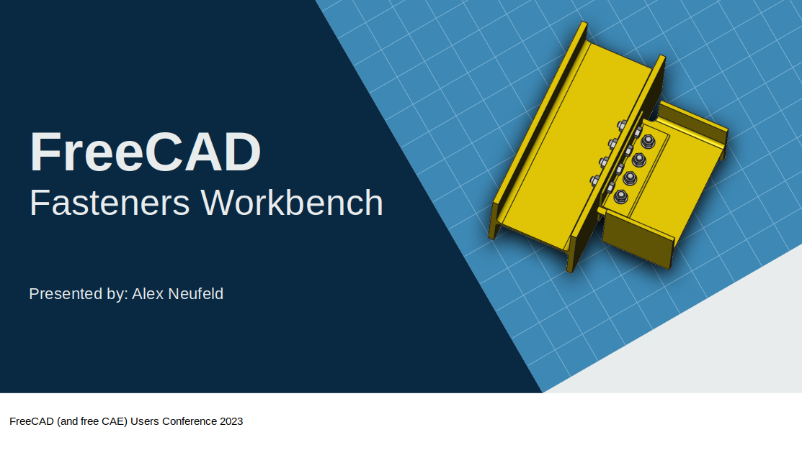
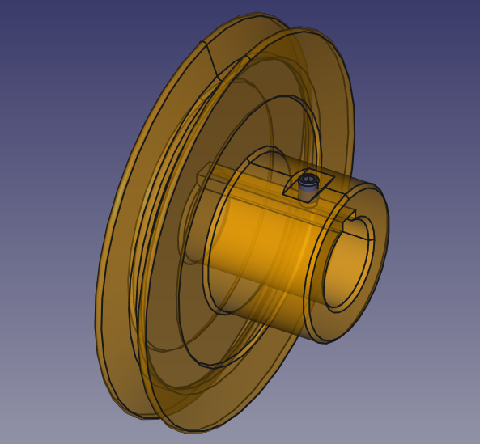
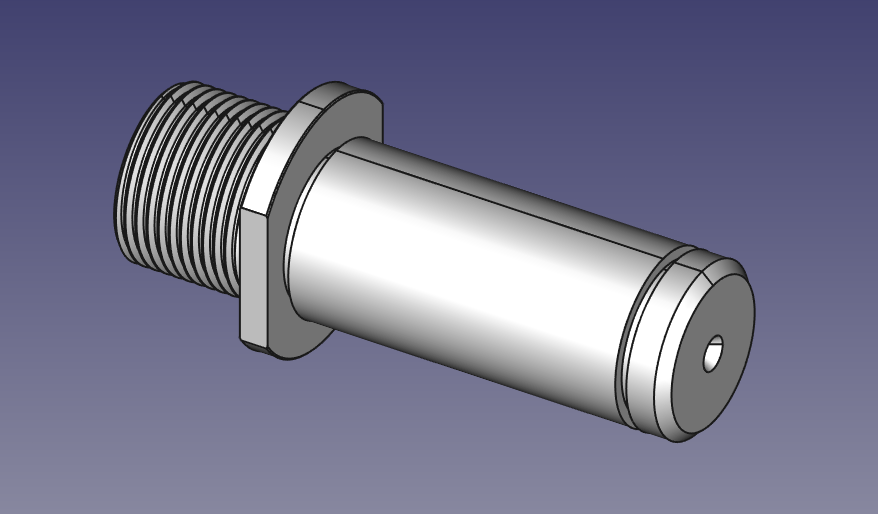
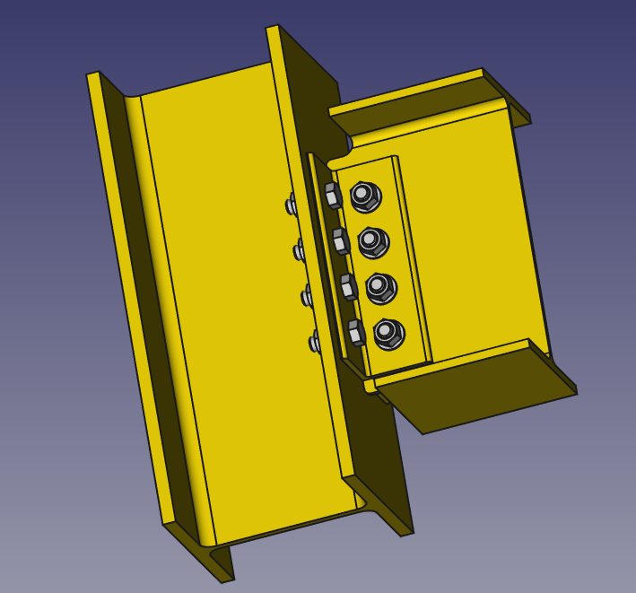
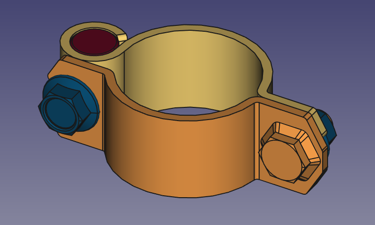

# 2023 FreeCAD (and free CAE) User Conference 2023

## FreeCAD Fasteners Workbench Presentation supplementary content

This repository has example `.FCStd` files used to demonstrate the use of the fastners workbench. Links to realted content and my contact information are also provided.

## Links

- [FreeCAD Fasteners Workbench source code](github.com/shaise/freeCAD_FastenersWB)
- [Fasteners Workbench forum thread](https://forum.freecadweb.org/viewtopic.php?t=11429)

## Contact Me

- Github: [@alexneufeld](https://github.com/alexneufeld)
- FreeCAD Forum: @alex_55
- E-mail: [alex.d.neufeld@gmail.com](mailto:alex.d.neufeld@gmail.com)

## Examples directory

All models were created using FreeCAD version 0.20.

### Simple_Part

The most basic possible example of Fasteners Workbench usage. A single screw is attached to a PartDesign body.

### Threaded_Shaft

Used to demonstrate the ScrewTap and ScrewDie object functionality.

### I_Beam_Asm

A simple assembly of a structural beam connection, with duplicates of multiple types of fasteners. The Bill of Materials too can be used to count the number and type of scews, washers, and nuts used.

### Pipe_Clamp

A more advanced example that demonstrates a more general use of fasteners objects for solid modelling.

